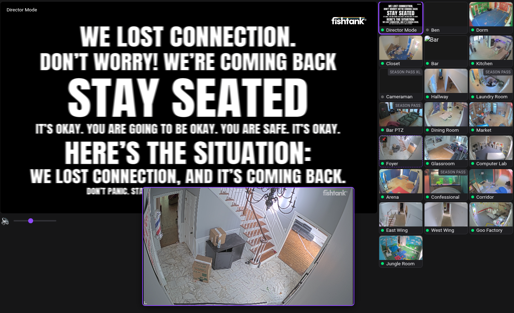

Simple UI for fisthank.live. Proxies all requests to the official API and requires an account.

Usage:

```
python -m venv && source venv/bin/activate && python run.py
```

Or download a prebuild binary from [relasese](https://github.com/cohlexyz/ftview/releases).

Go to localhost:8000 and login with your fishtank.live credentials. They will be saved locally to `credentials.json`.

Features

- Camera grid with all cameras listed in the API
- Main view
- Secondary pop up view. Click any camera in the grid while holding shift to open the popup view
